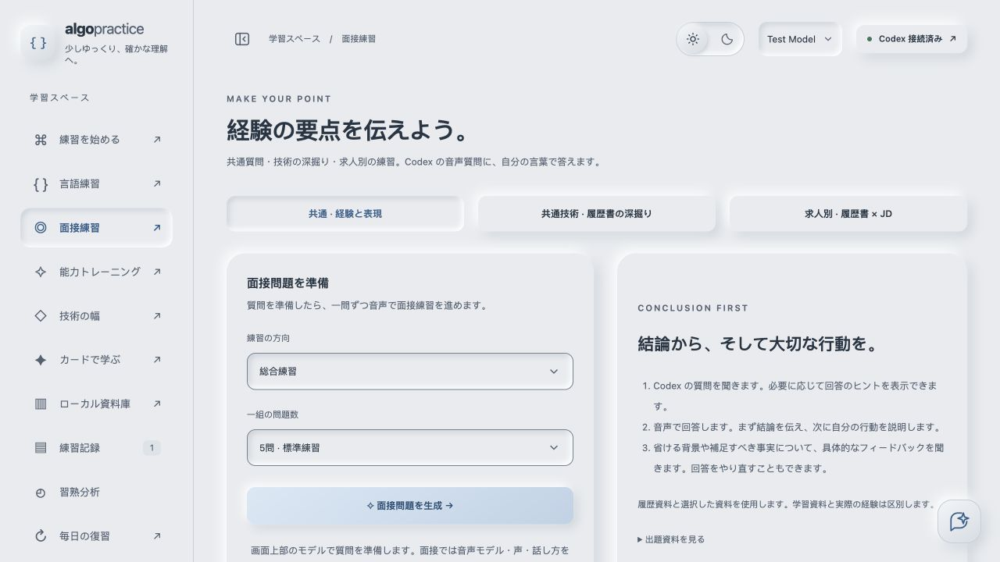
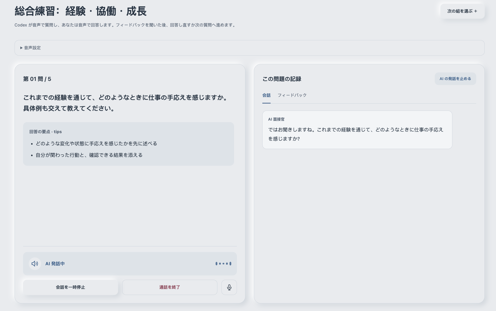
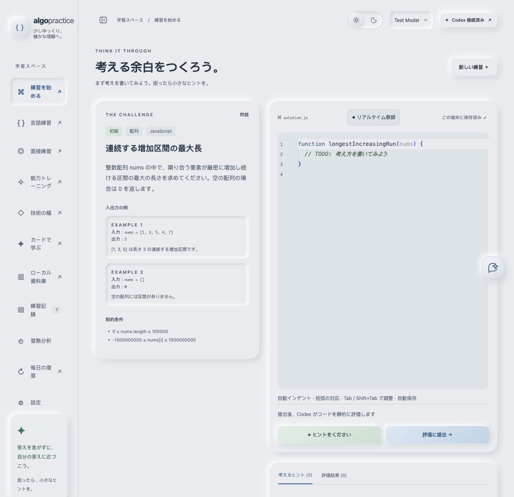
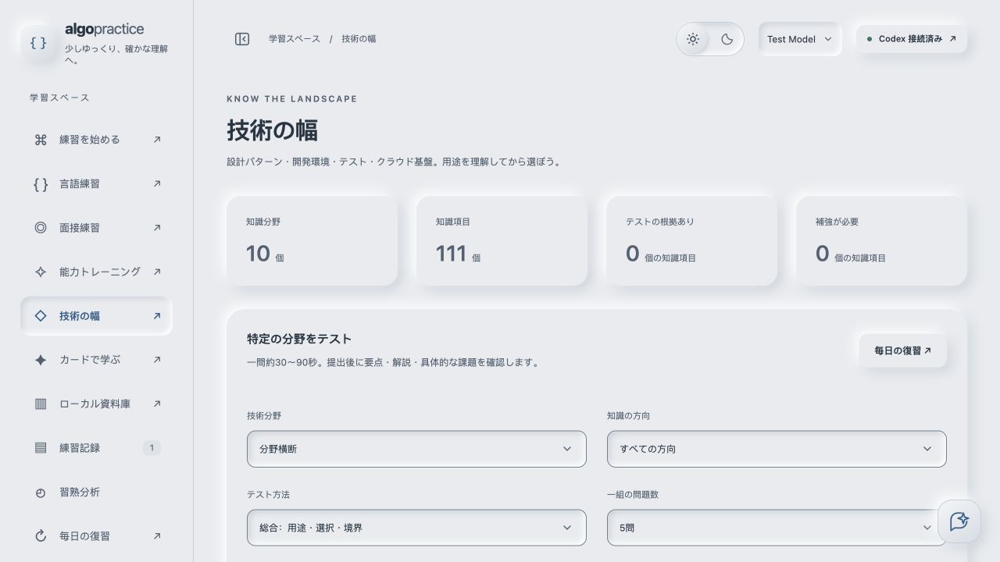
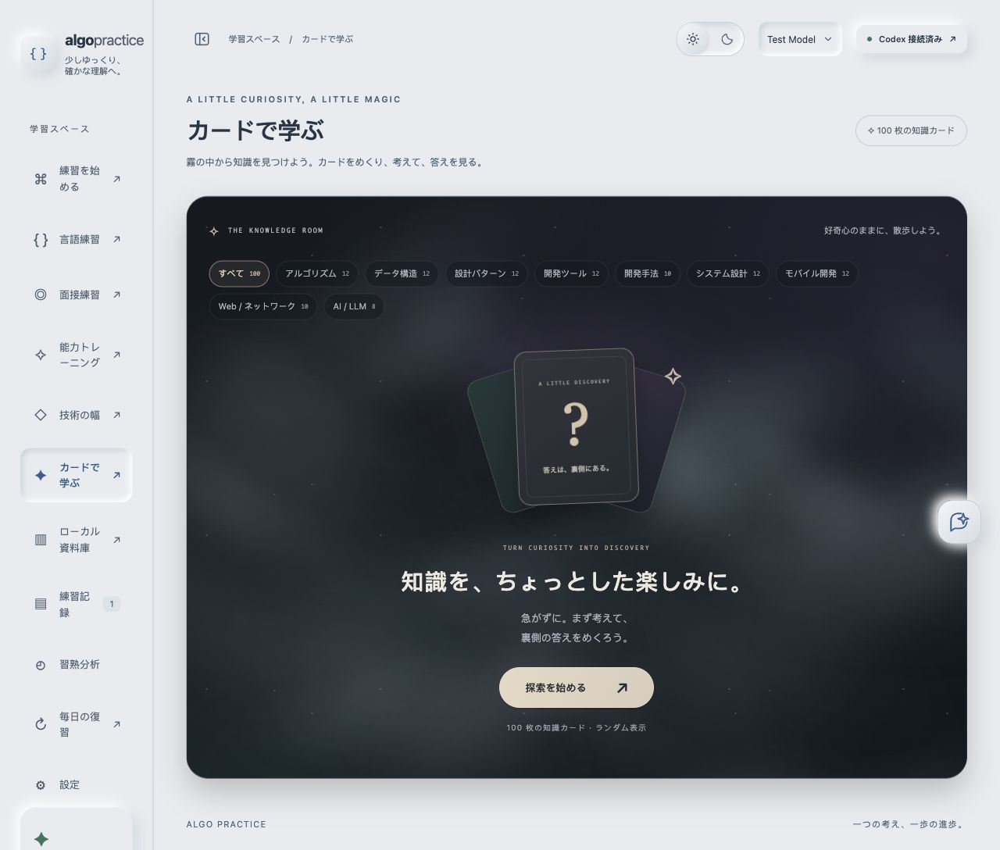

# RecruitAgent

[日本語](../README.md) | [English](README.en.md) | [简体中文](README.zh-CN.md)

A local AI interview and learning tool built for preparing for a career move in Japan. Organize your work experience, practice explaining it in Japanese, and review technical knowledge in one place. Voice interviews and the voice demo are optional features.

Released under the MIT license. Documents, learning records and login credentials are stored on your computer. When you use AI, the questions, code, documents or audio needed for that task are sent to the relevant service.

## Features

- **Interview preparation:** prepare common questions, technical follow-ups and job-specific questions based on your résumé, project experience and job description (JD).
- **Answers and reflection:** practice stating your conclusion, your own actions and how you verified the result. Keep real experience separate from study material.
- **Technical review:** practice algorithms and programming languages, work through engineering scenarios, test technical breadth and explore knowledge cards.
- **Documents and progress:** manage local documents, revisit practice records, review knowledge and create backups.
- **Languages:** set the interface language and AI output language independently. Japanese, English and Chinese are supported.

## Screenshots

These screenshots show the Japanese interface. The voice interview image is cropped from the running app and contains no personal documents or account identifiers. The other images use an isolated demo environment. `Test Model` is a demo model.

### Interview preparation

Choose an interview type and topic, then prepare questions using the documents you selected.



### Voice interview

Choose the interview language, voice and tone, then answer Codex's questions by voice. Read the answer transcript and feedback on the same page.



### Algorithm practice

Read the problem, write code, and request hints or a static assessment when needed.



### Technical breadth

Choose a technical field and topic to review your knowledge.



### Knowledge cards

Choose a category and start exploring the knowledge cards.



## Download and launch

Requires **Node.js 22.19.0 or later**, including npm. The first launch needs an internet connection to download dependencies. Web assets are built on each launch.

Download and extract the project ZIP from GitHub, or clone the repository. Launch from the project folder:

- macOS: double-click `start.command`. If the executable permission was lost during download, run `chmod +x start.command` in a terminal.
- Windows: double-click `start.cmd`.
- Linux: run `sh start.sh` in a terminal.

You can also launch from a terminal on any of these systems:

```sh
node scripts/launch.mjs
```

The launcher checks the Node.js version and port, installs missing dependencies from the lockfile, builds the web assets and opens your browser. The default URL is [http://localhost:3000](http://localhost:3000). Stop the server with `Ctrl+C`.

Once dependencies are installed, `npm start` also works. Use `npm run doctor` to check your environment, and run `npm ci --ignore-scripts` after dependency changes.

## First use

The initial interface language is Chinese. In `设置 → 语言设置` (Settings → Language settings), change `界面语言` (Interface language) and `用户语言` (User language) to `English` and save. Choose `日本語` for Japanese interview practice. Existing documents and AI output keep their original language; newly generated content uses the selected user language. Bundled knowledge cards use the selected user language through the three-language resources.

1. Open Settings → Getting started and choose Connect Codex at the top right.
2. Authenticate with your own account on the official OpenAI page. Model access and usage limits depend on actual request results.
3. Algorithms, programming language practice, study and chat are ready to use. For interview practice, first upload your own PDF or Markdown to the local document library.
4. In Interview practice → Question sources, select each document's role and save. Select at least one résumé or project experience document. Give personal cases and technical study material separate roles.
5. For scanned PDFs or images, organize them in the library first to extract text.

Browsing documents and uploading text documents do not call a model. Automatic organization, AI practice and chat do. Code assessments are static; user code is not executed.

If the authorization window is blocked, open the link in the authorization dialog. If the local callback port is unavailable, follow the dialog's instructions to paste the callback URL. Do not paste API keys or OAuth tokens.

## Optional voice features

Voice features additionally require **Codex CLI** on your computer and a separate CLI login. Follow the [official Codex CLI instructions](https://developers.openai.com/codex/cli), then run:

```sh
codex login
```

Check the voice connection under Settings → Getting started, or open the voice demo. Authorization at the top of the web interface is for text features and does not replace CLI login. Other learning features remain available without the CLI.

Voice uses the experimental Codex app-server / WebRTC interface. Availability depends on the CLI version, account and server permissions. Recording starts only after microphone access is granted. Interviews save answer transcripts and feedback; the demo does not save recordings or captions. Audio is sent to OpenAI during a call.

## Configuration

Copy `.env.example` to `.env` and edit it as needed. It is loaded at startup; environment variables set in your terminal take precedence. Relative paths are resolved from the project folder.

| Variable | Default / purpose |
| --- | --- |
| `PORT` | `3000`: local server port |
| `DATA_DIR` | `./data`: learning records, credentials and original documents |
| `SOURCE_DIR` | `./sources`: compatible import of existing PDFs and Markdown; optional |
| `PI_MODEL` | `gpt-5.5`: initial text model; a saved model selection takes precedence |
| `CODEX_BIN` | `codex`: CLI path for voice features |
| `OPEN_BROWSER` | `1` in the launcher; set to `0` to disable automatic browser opening |

Restart after changing configuration. If the port is busy, change `PORT`. The model list comes from the backend SDK; choose models and their visibility in the interface.

Existing `data/state.json` and document folders remain compatible. Once you save a new question source selection, interview preparation uses those selected documents. Personal document folders are excluded from public releases.

## Data backup

Download a `.json.gz` file from Settings → Data backup to save your learning records and documents. Login credentials are excluded.

See [Source structure](architecture.md) for the code layout and change locations.
